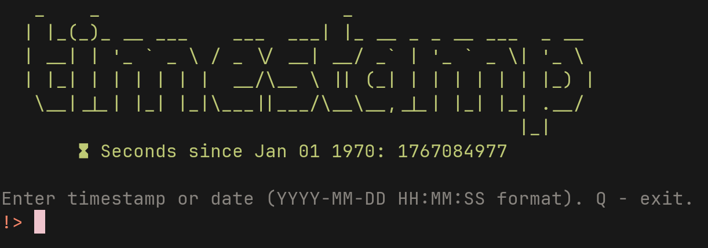

# timestamp
A small `node.js` utility that allows you to calculate **UNIX timestamps**.

## UNIX Timestamp?
A **UNIX Timestamp** (also called `UNIX time` or `POSIX` time) is a simple way for computers to track time. Instead of using dates like "December 30th, 2025," it counts the total number of **seconds** that have passed since **Jan 01, 1970** (UTC).

## Installation
1. Install `node.js`, depending on your distro:
```sh
xbps-install node # void
pacman -S nodejs # arch/artix/manjaro/cachy/endeavour ...
apt install nodejs npm # debian/ubuntu/mint/lmde ...
```

2. Download `timestamp.js` file:
```sh
curl -LO https://github.com/emore-xpxx/timestamp/releases/download/1.0/timestamp.js # curl
wget https://github.com/emore-xpxx/timestamp/releases/download/1.0/timestamp.js # wget
```

3. Run!
```sh
node timestamp.js
```

## Images


## License
**MIT** (**X11**) See [LICENSE.md](LICENSE.md) for details.
